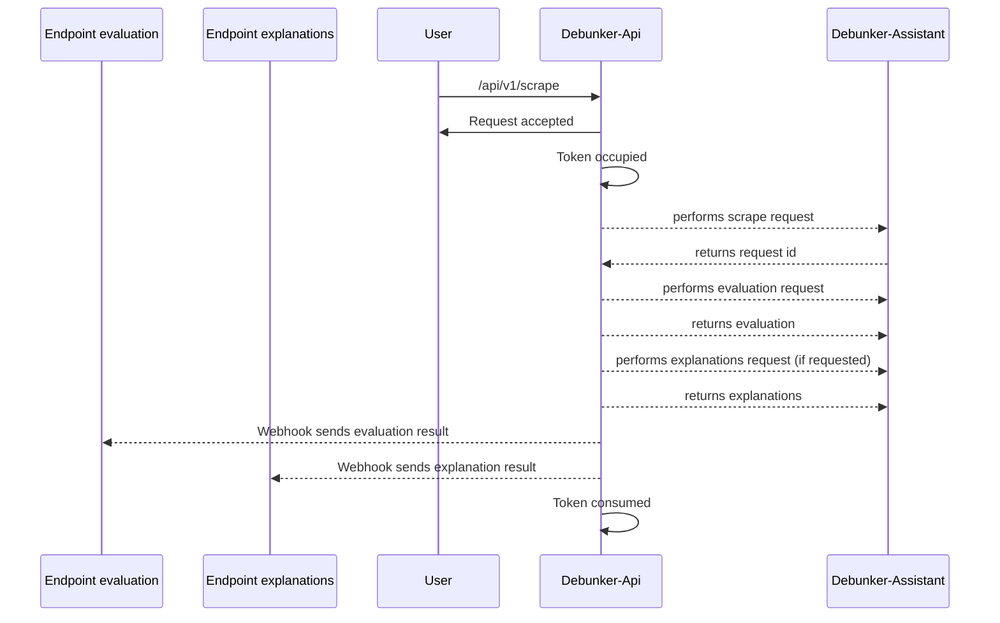

# DEBUNKER ASSISTANT API - Debunker Api

This service is an API wrapper to interface with the Debunker Assistant service [https://github.com/aequa-tech/debunker-assistant](https://github.com/aequa-tech/debunker-assistant).

**Features**
- User-based API consumption, with API key and secret (headers `X-API-Key`, `X-API-Secret`) associated with tokens for call consumption.
- Rate limiting (production environment)
- Callbacks for `evaluation` and `explanations` requests after `scrape` query
- Response message language configurable via the `Accept-Language` header

## Installation
To start the project, Docker (or Docker Desktop) must be installed on your machine [https://docs.docker.com/get-docker/](https://docs.docker.com/get-docker/)

The project is based on Ruby on Rails, specifically Ruby 3.1.4 and Rails 7.0.8.1.

**Customization**
In the project root, there is a `.docker.env` file.
This contains the env variables necessary for the project's functionality.
Edit this file if you need particular configurations, such as setting the base URL of the `Debunker Assistant` service (`DEBUNKER_API_V1_URL`).

The single project is designed to be started with the `development` environment.
If you want to start it in production mode, the `RAILS_ENV` variable is present in the `environment` section of the service in the `docker-compose.yml` file.

**Starting the project**
`docker compose up --build` / `docker compose up`

## Usage
**Debunker Api** exposes the service on port `3001`
You can therefore query the APIs using `localhost:3001` as the host.

The service exposes 2 API routes:
- _POST_ **scrape** `localhost:3001/api/v1/scrape`
- _GET_ **status** `localhost:3001/api/v1/users/status`

Below is a sequence diagram of a happy path for `scrape`.
_NOTE: The endpoint addresses for receiving the `evaluation` and `explanations` webhooks are configured in the payload sent to `scrape`_

The complete API (and payloads) documentation is available in the `reference.yml` file (OpenApi 3.x specification).

## Contributing
_insert text_

## License
_insert text_

## Contact
_insert text_
